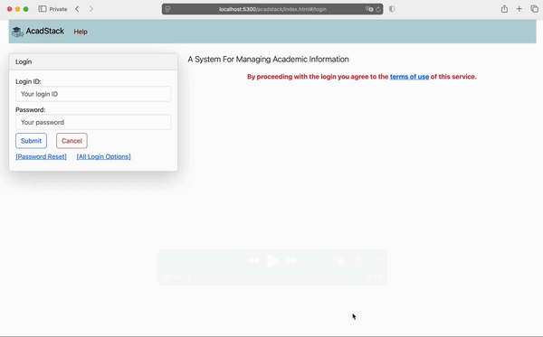

# AcadStack :: A System For Managing Academic Information

## Background

This system is meant for managing the academics information about the courses as they run in a university. Typically, a university offers several degree **programs** such as BSc, MSc, BTech, MTech, PhD. Each program requires the students to credit certain number of courses. Courses can be of elective or mandatory, and may be offered in specific academic sessions of the year. Certain minimum attendance of students in lectures may be required. Thus, the attendance data also may be required to be captured.

This application acadstack to efficiently manage information about various **courses**, the **offerings** of those courses by various **instructors**, the **students** and course **enrollment** in those course offerings. Capturing all this informat allows deriving useful, actionable analytics about the university's academics.

## Basic Demo Screencast
(_May take a few seconds to load ~16MB .gif file._)


## Environment setup

### System requirements

1. git client and cmake should be installed on your machine.
2. The backend code is written using Python 3.9 or higher
3. Postgresql (Can be downloaded from https://www.postgresql.org/download/ or installed via your operating system's package manager, or using docker container).

4. NodeJS stable LTS version. (Can be installed by following these steps: https://nodejs.org/en/download/). We use node for setting up VueJS client app (https://cli.vuejs.org/guide/installation.html).
5. We use [Visual Studio Code](https://code.visualstudio.com/) for developing and debugging code. Install [Microsoft's Python](https://marketplace.visualstudio.com/items?itemName=ms-python.python) and [VueJS Vetur](https://marketplace.visualstudio.com/items?itemName=octref.vetur) extensions.

### Steps to prepare the local development workspace

1. Create a python virtual environment for this project. See this for how to do it: https://docs.python.org/3/library/venv.html. E.g., you can run the following: `python3 -m venv ~/.venv/AcadStack` to create the virtual environment in `~/.venv/AcadStack` folder.
3. Open a shell and `cd` into a directory that you want to work in.
4. Clone this git repository if you are a contribitor: `git clone https://github.com/bsodhi/acadstack_ce.git`.
5. Run `cd acadstack_ce` and then `source ~/.venv/AcadStack/bin/activate` to activate the python virtual environment.

7. Run `pip install -r api_service/requirements.txt`.

    > **NOTE:** Some modules may fail to install due to unavailability of certain native libraries or headers on your OS. You can Google the error text to find a solution.
    
8. Install necessary dependencies for VueJS app:
    1. `cd webapp` 
    1. `npm install`

### Creating docker images for the application

To build a Docker image for hosts having different CPU architecture than the one on
which you are building the images (e.g. linux/amd64 Docker image on a macOS machine,
which uses an ARM-based Apple M-series processor), you must use Docker's buildx command.
This tool leverages QEMU emulation to build images for a different architecture than your host machine.

1. Open a shell into the folder containing the `docker-compose-local.yml` file.
1. Ensure Buildx is enabled. `docker buildx` is included with recent versions of Docker Desktop.
Run the following command in your terminal to verify that it is working:
`docker buildx version`
1. Create a builder instance with emulation support:
`docker buildx create --name mybuilder --use`
1. Verify and start the builder:
`docker buildx inspect --bootstrap` Rerun this command if you see "context deadline exceeded" error.
The `docker buildx inspect` command will confirm that the builder is ready and supports `linux/amd64`
1. Run the following to build the acadstack-backend image:
`docker buildx build --platform linux/amd64 -t sodhix/acadstack-backend:v.01 --file api_service/Dockerfile --load .`
    - `--load`: Loads the resulting image into your local image cache.
    - `--platform linux/amd64`: Tells Docker to build the image for the linux/amd64 architecture.
    - `-t`: Use the tag that you want for your image.
1. Push the image to docker hub or your own registry:
`docker push sodhix/acadstack-backend -a` Make sure you are logged into the registry (e.g docker hub) for the push to succeed.
1. Follow the same steps to build and push the image for acadstack-frec-service:
`docker buildx build --platform linux/amd64 -t sodhix/acadstack-frec-service:v.01 --file frec_service/Dockerfile --load .`

## Running the application

After setting up the workspace as per the steps listed above you can deploy and run the application for development. Following are the steps:

1. `cd ./webapp`
1. Compile the VueJS app: `npm run build`
1. Start the PostgreSQL server.
1. Edit the `./api_service/config.json` to set proper values for the database connection information, and other settings.
1. Edit the `app_env_vars.env` to set require environment variables
1. Source this file to set these variables in 
current shell: `source app_env_vars.env`
1. `cd ./api_service`
1. `source ~/.venv/AcadStack/bin/activate` to activate the python virtual environment.
1. Run `python demo_data.py config.json` to create the database and populate with demo data. Check the `demo_data.py`
script for more details and options.
1. Run `python main.py` to start the web application.
1. Open `http://localhost:5300/acadstack/app/index.html` Change the port as per your config.json setting.
1. Login using ID `acad.user` and password `abcd1234`


## Docker based deployment

You can deploy the application using docker. Make sure that docker is installed
on the machine on which you will run the following steps. Please see this https://docs.docker.com/engine/install/
for the instructions about how to install docker engine on your machine.

**NOTE:** _By default we build the face recognition service (acadstack-frec-service). 
It is used for face recognition based attendance where an instructor/TA may upload
photos of students present in a lecture in a classroom. 
You may exclude building this image/container if you do not want to use it._


1. On the target host, create a directory from where you will be deploying. E.g. by running `mkdir $HOME/acadstack-docker`
1. Change directories into that folder: `cd $HOME/acadstack-docker`
1. Copy the `docker-compose.yml` and `app_env_vars.env` to `$HOME/acadstack-docker` folder.
1. Edit `app_env_vars.env` if needed. For simple demo you can leave it unchanged (except for the port number 
if it collides with something already running on your host).
1. Run `docker compose --env-file app_env_vars.env up -d` to launch the containers.
1. Run `docker ps | grep acadstack` to verify that the containers are up. You may see something like the following:
```bash
$ docker ps | grep acadstack
2f1cd5e70109   sodhix/acadstack-backend:v.01             "python main.py"         20 minutes ago   Up 19 minutes         0.0.0.0:5300->5300/tcp, [::]:5300->5300/tcp            acadstack_backend
5109005ae0bc   postgres:17                          "docker-entrypoint.s…"   20 minutes ago   Up 19 minutes         0.0.0.0:5432->5432/tcp, [::]:5432->5432/tcp            acadstack_postgres
e0875d9fd10e   sodhix/acadstack-frec-service:v.01        "python run.py"          20 minutes ago   Up 19 minutes         0.0.0.0:5060->5060/tcp, [::]:5060->5060/tcp             frec_svc
```
1. Run `docker exec -it acadstack_backend /bin/bash` to open a shell into the backend container. You should see:
```bash
$ docker exec -it acadstack_backend /bin/bash
root@2f1cd5e70109:/app# 
```
1. In the above container shell, run the following to create the demo data:
`python demo_data.py config.json` You should see something like the following:
```bash
$ docker exec -it acadstack_backend /bin/bash
root@2f1cd5e70109:/app# python demo_data.py config.json 
========== Setting up DEMO database ==========
Dropping the schema: acadstack_db
Creating the schema: acadstack_db
Database 'acadstack_db' initialized.
Created DB tables.
Created academic sessions
Creating users...
Added 290 users. Password for each user is: abcd1234
Creating courses...
Added 28 courses.
Creating course offerings and enrolling students...
Added 100 offerings, each with 46 students.
Creating course offerings and enrolling students...
Added 100 offerings, each with 46 students.
Creating course offerings and enrolling students...
Added 100 offerings, each with 46 students.
Creating course offerings and enrolling students...
Added 100 offerings, each with 46 students.
Creating course offerings and enrolling students...
Added 100 offerings, each with 60 students.
Creating course offerings and enrolling students...
Added 100 offerings, each with 25 students.
Creating course offerings and enrolling students...
Added 100 offerings, each with 25 students.
Creating course offerings and enrolling students...
Added 100 offerings, each with 60 students.
Creating course offerings and enrolling students...
Added 100 offerings, each with 25 students.
Creating course offerings and enrolling students...
Added 100 offerings, each with 60 students.
Creating course offerings and enrolling students...
Added 100 offerings, each with 25 students.
Creating course offerings and enrolling students...
Added 100 offerings, each with 60 students.
Done adding demo data.
root@2f1cd5e70109:/app#
```
1. Open the browser at `http://localhost:5300/acadstack/` and login 
using ID `acad.user` and password `abcd1234`. 
You may have to change the port (5300 is default) and the password
if you altered the one in `app_env_vars.env` and `config.json`.