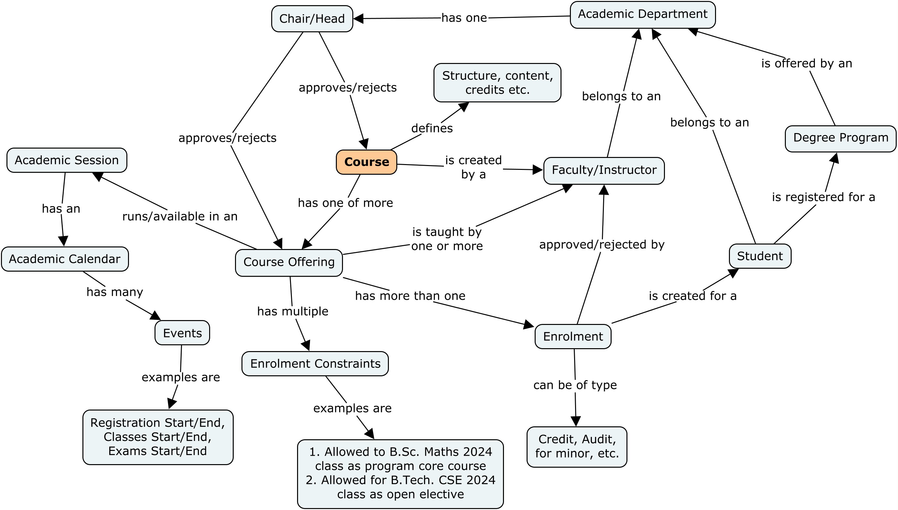
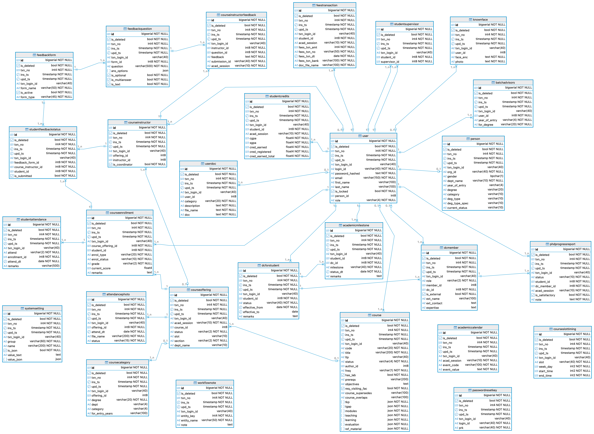

# Architecture of the AcadStack system
AcadStack is built using a simple 3-tier architecture. It comprises of the usual
three tiers:
1. Database tier hosting PostgreSQL for data persistence.
1. Business logic runs in the API layer which is hosted in a python [Quart](https://quart.palletsprojects.com/en/latest/) based implementation.
1. Frontend is built using [VueJS Router](https://router.vuejs.org/guide/) based single page application.

## Project folder structure
```
.
├── project.code-workspace
├── api_service       <--- Backend APIs
│   ├── acadstack_app.py   <--- Entry point to the application
│   ├── api_XYZ.py    <--- Various backend API modules
│   ├── ...
│   ├── app      <--- Generated by "npm run build" on ../webapp
│   │   ├── assets
│   │   │   ├── index-Bm6wB8.js
│   │   │   └── ...
│   │   ├── default.html
│   │   ├── favicon.ico
│   │   └── index.html
│   ├── ...
│   ├── config.json
│   ├── email_templates
│   │   ├── templ1.txt
│   │   └── ...
│   ├── models.py  <--- Defines PeeWee ORM models
│   ├── nav.json  <--- Navigation structure for frontend.
│   ├── report_templates
│   │   ├── report_1.html
│   │   └── ...
│   ├── requirements.txt
│   ├── server_error.log
│   ├── server.log
│   ├── sql_statements.toml
│   ├── static_data.json.  <--- Dropdown labels and values.
│   ├── tests
│   │   ├── config_test.json
│   │   └── ...
│   └── ...
├── README.md
├── scripts   <--- DDL, DML and other shell scripts. 
│   ├── some_DDL.sql
│   └── ...
├── test_data
│   ├── data_1.csv
│   └── ...
└── webapp     <--- Frontend VueJS code
    ├── index.html
    ├── jsconfig.json
    ├── node_modules
    ├── package-lock.json
    ├── package.json
    ├── public
    │   ├── default.html
    │   └── favicon.ico
    ├── README.md
    ├── src
    │   ├── App.vue
    │   ├── assets
    │   │   ├── css
    │   │   │   ├── ...
    │   │   ├── js
    │   │   │   └── ...
    │   │   └── logo.svg
    │   ├── components.   <--- AcadStack GUI components go here.
    │   │   ├── Component_1.vue
    │   │   └── ...
    │   ├── main.js
    │   └── router
    │       └── index.js
    └── vite.config.js
```

## Important business concepts
The application is built around the core concepts of how the academic
programs are run at a typical university or college. Main concepts are
shown in Fig. 1 below. 
Fig. 1 (Concept map for AcadStack entities.)

## Backend API structure
The backend API for the application is structured around the business concepts
shown in Fig. 1. For example, most of the APIs concerning a __Course__ are
implemented in __api_course.py__, the ones concerning __CourseOffering__ are
implemented in __api_course_offering.py__ module, and so on. The common functions
are refactored into modules such as __api_common.py__, __common.py__, etc.

To see how the backend APIs connect to the frontend, the easiest way is to
look at the `create_app` function in the application's entry point __acadstack_app.py__.
Here, you will see the request URL mapping to different API functions.

Routes specific to each api module are defined in the respective modules itself
in its `init_routes(bp:Blueprint)` function.
For example, the `init_routes` for `api_course.py` module looks like this:

```python
def init_routes(bp: Blueprint):
    bp.add_url_rule('/cour/<int:my_id>', view_func=course_view, methods=['GET'])
    bp.add_url_rule('/cour_save', view_func=course_save, methods=['POST'])
    bp.add_url_rule('/cour_find', view_func=course_find, methods=['POST'])
    ...
```

## Handling role based access control (RBAC)
Roles are central to the entire functionality of the AcadStack application.
RBAC is implemented via the decorator `rbac()` defined in `common.py`.
Example usage of the decorator is:
```python
@rbac(roles=["ACA", "FAC", "DEA", "HOD", "RES"])
async def course_save():
    ...
```
The above usage states that the function `course_save` can be invoked
only when the logged in user has any of the roles indicated in the
`roles` attribute of the decorator which in the above example is
`"ACA", "FAC", "DEA", "HOD", "RES"`.

Checking of roles can also be done deeper inside any API functions by invoking
`is_user_in_role()` function of `api_common.py` which also provides several
other functions for common tasks.

| Role Code    | Detail |
| -------- | ------- |
| ACA  | Role used for university's academics section staff. |
| DEA | Role for Dean of Academics |
| HOD | Role for head of an academic department. E.g. HoD or Civil Engineering. |
| FAC | Role assigned to faculty members. |
| STU | Role assigned to students. |
| RES | Role assigned to research section admin staff. |
| SUP | Superuser role |

You may add, remove or edir these roles as required. When removing or editing
an existing role please ensure that you update all the frontend and backend
references to the role. This includes any references in SQL queries as well.

### Using roles in the frontend
The role codes are also used for controlling the visibility/state of UI
components. For example, the `api_service/nav.json` defines the navigation
structure for the Vue based frontend app. In the navigation structure we
use role codes to decide whether to include a navigation item for the current
logged in user or not. An example entry is shown below:
```json
{
    "label": "Offer a Course For Enrolment",
    "href": "#/co.detail",
    "roles": "FAC,ACA",
    "menu": "Courses"
}
```
This entry implies that the navigation menu named "Courses" will have an item
named "Offer a Course For Enrolment" only when the logged in user has a role
`FAC` or `ACA`.
Functions are provided in `webapp/src/main.js` for checking current user's
roles from deeper inside the Vue/JavaScript code.

## Data access layer (DAL)
The DAL code makes use of the [PeeWee](https://docs.peewee-orm.com/en/latest/) ORM.
Some queries are also performed by running them directly on the underlying
`db` object of the ORM instance (see https://docs.peewee-orm.com/en/latest/peewee/api.html#Database.execute_sql). These queries are defined in `sql_statements.toml`.

Models are defined in the module `models.py`. The Postgresql schema ERD
is shown in Fig. 2 below.



## Frontend implementation
The frontend GUI is built using [VueJS Router](https://router.vuejs.org/guide/)
based single page application (see the project structure).
The application is composed from independently usable Vue components.
Most of the components are mapped to a Vue route. These mappings are defined
in `webapp/routed/index.js`.

Please see the entry point component for details about how it starts when
loaded in the application page after login: `webapp/src/App.vue`.