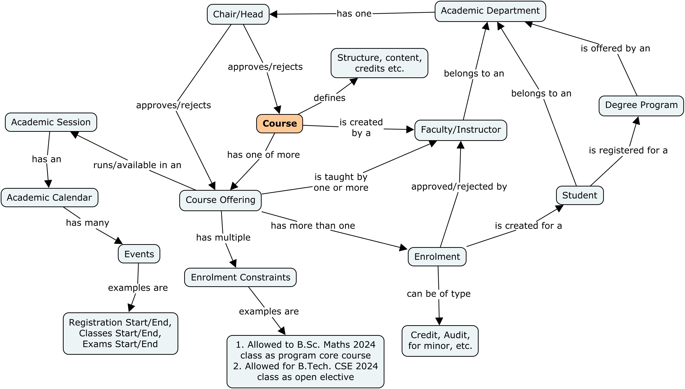
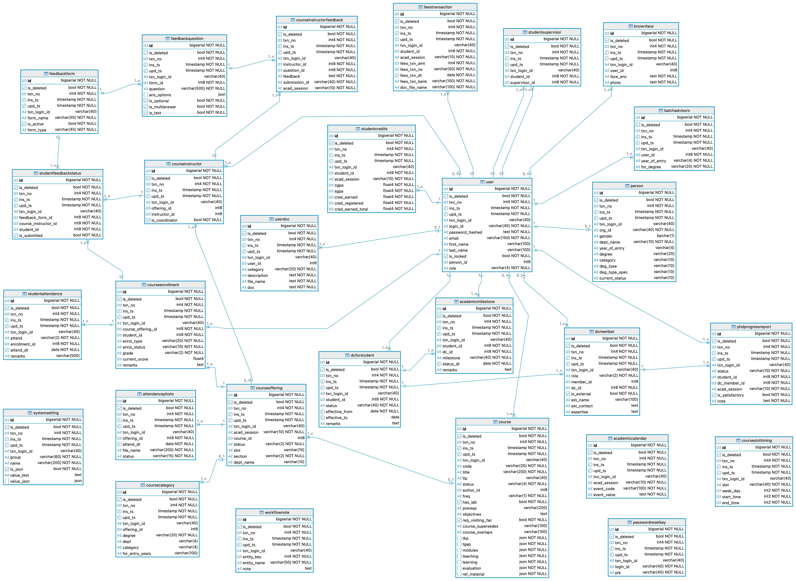

# Architecture of the AcadStack system
AcadStack is built using a simple 3-tier architecture. It comprises of the usual
three tiers:
1. Database tier hosting PostgreSQL for data persistence.
1. Business logic runs in the API layer which is hosted in a python [Quart](https://quart.palletsprojects.com/en/latest/) based implementation.
1. Frontend is built using [VueJS Router](https://router.vuejs.org/guide/) based single page application.

## Project folder structure
```
.
├── project.code-workspace
├── api_service       <--- Backend APIs
│   ├── acadstack_app.py   <--- Entry point to the application
│   ├── api_XYZ.py    <--- Various backend API modules
│   ├── ...
│   ├── app      <--- Generated by "npm run build" on ../webapp
│   │   ├── assets
│   │   │   ├── index-Bm6wB8.js
│   │   │   └── ...
│   │   ├── default.html
│   │   ├── favicon.ico
│   │   └── index.html
│   ├── ...
│   ├── config.json
│   ├── email_templates
│   │   ├── templ1.txt
│   │   └── ...
│   ├── models.py  <--- Defines PeeWee ORM models
│   ├── nav.json  <--- Navigation structure for frontend.
│   ├── report_templates
│   │   ├── report_1.html
│   │   └── ...
│   ├── requirements.txt
│   ├── server_error.log
│   ├── server.log
│   ├── sql_statements.toml
│   ├── static_data.json.  <--- Dropdown labels and values.
│   ├── tests
│   │   ├── config_test.json
│   │   └── ...
│   └── ...
├── README.md
├── scripts   <--- DDL, DML and other shell scripts. 
│   ├── some_DDL.sql
│   └── ...
├── test_data
│   ├── data_1.csv
│   └── ...
└── webapp     <--- Frontend VueJS code
    ├── index.html
    ├── jsconfig.json
    ├── node_modules
    ├── package-lock.json
    ├── package.json
    ├── public
    │   ├── default.html
    │   └── favicon.ico
    ├── README.md
    ├── src
    │   ├── App.vue
    │   ├── assets
    │   │   ├── css
    │   │   │   ├── ...
    │   │   ├── js
    │   │   │   └── ...
    │   │   └── logo.svg
    │   ├── components.   <--- AcadStack GUI components go here.
    │   │   ├── Component_1.vue
    │   │   └── ...
    │   ├── main.js
    │   └── router
    │       └── index.js
    └── vite.config.js
```

## Important business concepts
The application is built around the core concepts of how the academic
programs are run at a typical university or college. Main concepts are
shown in Fig. 1 below. 
Fig. 1 (Concept map for AcadStack entities.)

## Backend API structure
The backend API for the application is structured around the business concepts
shown in Fig. 1. For example, most of the APIs concerning a __Course__ are
implemented in __api_course.py__, the ones concerning __CourseOffering__ are
implemented in __api_course_offering.py__ module, and so on. The common functions
are refactored into modules such as __api_common.py__, __common.py__, etc.

To see how the backend APIs connect to the frontend, the easiest way is to
look at the `create_app` function in the application's entry point __acadstack_app.py__.
Here, you will see the request URL mapping to different API functions.

Routes specific to each api module are defined in the respective modules itself
in its `init_routes(bp:Blueprint)` function.
For example, the `init_routes` for `api_course.py` module looks like this:

```python
def init_routes(bp: Blueprint):
    bp.add_url_rule('/cour/<int:my_id>', view_func=course_view, methods=['GET'])
    bp.add_url_rule('/cour_save', view_func=course_save, methods=['POST'])
    bp.add_url_rule('/cour_find', view_func=course_find, methods=['POST'])
    ...
```

## Access control: permissions
The code checks permissions, never roles. A role is a named set of
permissions; each user has one role. Roles, permissions and the grants
between them are stored in the `role`, `permission` and `rolepermission`
tables, seeded by the baseline migration, and changed through the
`/perms` and `/perms_save` endpoints by users who hold `permissions.manage`.
Checks and the permission cache are in `policy.py`.

A permission is named `area.action`, optionally with a scope that limits the
records it covers:

| Scope | Covers |
| ----- | ------ |
| `:any` | every record |
| `:dept` | records of the user's own department |
| `:own` | records the user is linked to: themself, a course they teach, a student they supervise, and so on |
| `:pg` | PG/PhD records only |

A route names the permission it needs; the request gets through when the user
holds it at any scope:
```python
@P.require("offerings.edit")
async def course_offering_save():
    ...
```
The route then checks the record at hand, giving the rule for each scope:
```python
actor = P.current_actor()
if not actor.allowed("offerings.edit",
                     own=lambda: VAL.validate_course_instructor(cid),
                     dept=lambda: VAL.is_offering_in_actor_dept(cid, actor)):
    return apiVC.error_json("...")
```
`@P.require(perm, alert=True)` also reports a refusal as an access violation,
which locks the account of a user who may act only on their own records.
`actor.has("fees.view:any")` checks an exact code, for example to decide
whether a query is limited to the user's own rows.

Saving is refused if it would take `permissions.manage` away from the saving
user's own role, or if an admin changes their own role to one without it.
Only a user holding `permissions.manage` may edit such a user or grant such a
role.

The default roles:

| Role Code    | Detail |
| -------- | ------- |
| ACA  | University's academics section staff. |
| DEA | Dean of Academics |
| HOD | Head of an academic department. E.g. HoD or Civil Engineering. |
| FAC | Faculty members. |
| STU | Students. |
| RES | Research section admin staff. |
| SUP | Superuser |
| GUE | Guest |
| PLA | Placement cell |
| ADV | Advisor |

Where the code needs a kind of person, it selects the users whose role holds
a `roster.*` permission, never a role code:

| Permission | The role's users count as | Used for |
| ---------- | ------------------------- | -------- |
| `roster.student` | students | entry-number lookups, bulk enrolment, grade sheets, student lists |
| `roster.instructor` | instructors | the instructor lookup, DC supervisors, teaching load |
| `roster.acad_section` | the academic section | grade submission emails |

Python gets the roles with `P.roles_with("roster.student")`; SQL uses
`u.role = ANY(%s)` with that list as the parameter. Course offering emails go to
the department's head: an active user of the offering's department whose role
holds `offerings.edit:dept`, the permission to act on the offering.
`UserRoles` in the static data lists each role's roster flags (e.g.
`"roster": ["student"]`) for the frontend. The defaults grant them to `STU`,
`FAC` and `ACA`; a new or renamed role takes part by being granted
them on the *Roles & Permissions* screen.

`tests/test_permissions.py` holds, for every route, the roles that the
default grants let in; update it together with any change to the defaults.

### Menus
`api_service/nav.json` defines the navigation of the Vue app. Each entry names
the permission of the endpoint its page opens:
```json
{
    "label": "Offer a Course For Enrolment",
    "href": "#/co.detail",
    "perm": "offerings.edit",
    "menu": "Courses"
}
```
A plain name must be held at some scope; a scoped name such as
`students.academics:own` must be held exactly, so pages about the user's own
records show only to users who act on their own records.
The frontend follows the same rule: `/login` and `/current_user` send the
user's permissions, and components call `hasPermission(perm)` (in
`webapp/src/main.js`) to decide what to show, using the permission of the
endpoint a control calls. The server remains the enforcement point.

## Data access layer (DAL)
The DAL code makes use of the [PeeWee](https://docs.peewee-orm.com/en/latest/) ORM.
Some queries are also performed by running them directly on the underlying
`db` object of the ORM instance (see https://docs.peewee-orm.com/en/latest/peewee/api.html#Database.execute_sql). These queries are defined in `sql_statements.toml`.

Models are defined in the module `models.py`. The Postgresql schema ERD
is shown in Fig. 2 below.



## Frontend implementation
The frontend GUI is built using [VueJS Router](https://router.vuejs.org/guide/)
based single page application (see the project structure).
The application is composed from independently usable Vue components.
Most of the components are mapped to a Vue route. These mappings are defined
in `webapp/routed/index.js`.

Please see the entry point component for details about how it starts when
loaded in the application page after login: `webapp/src/App.vue`.