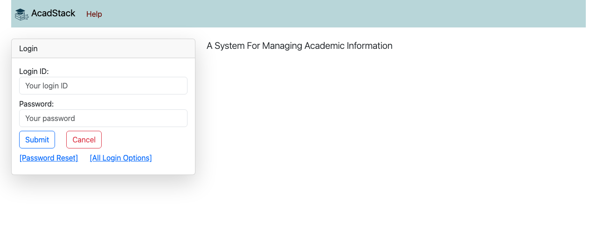
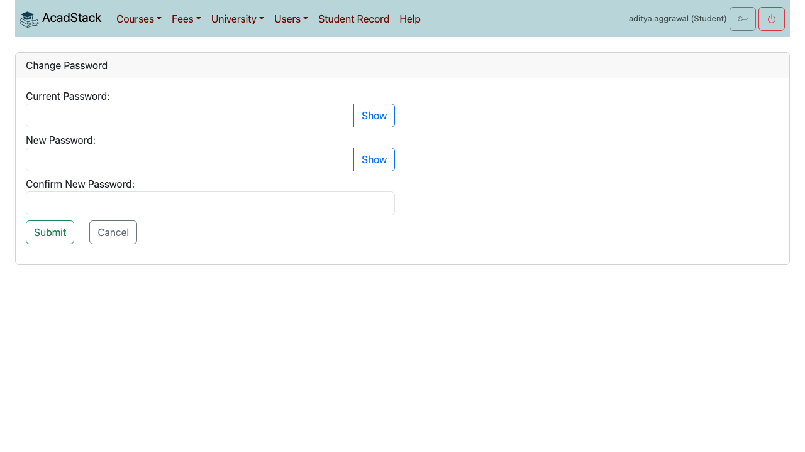
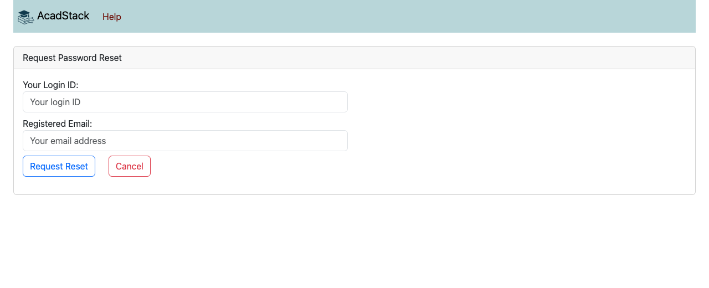
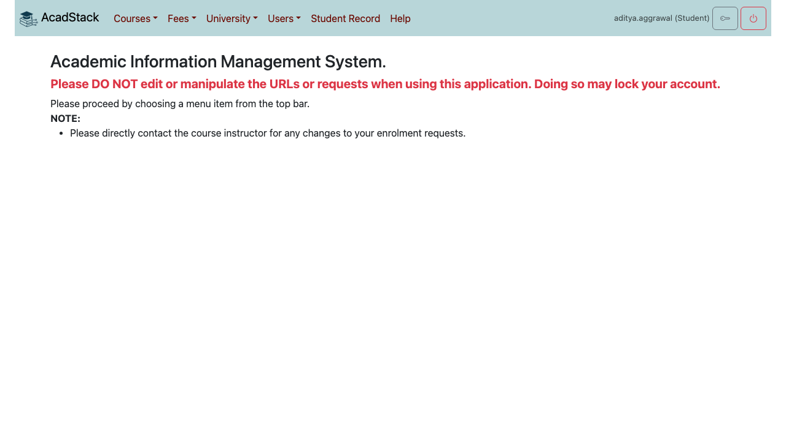
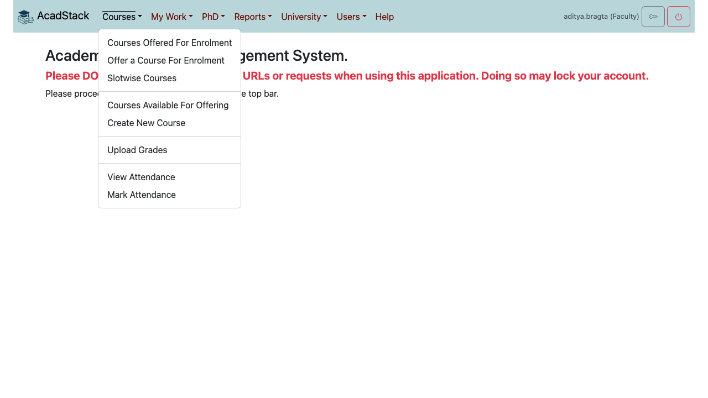
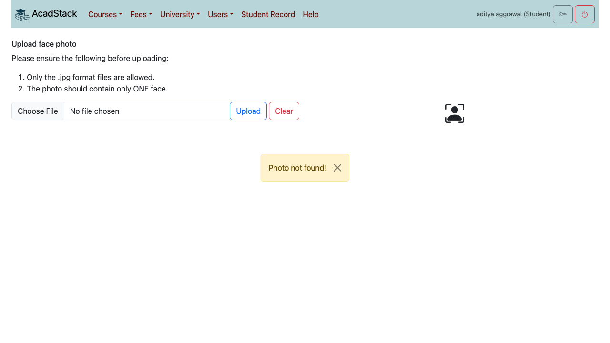

# 1. Getting started

This chapter is for everyone: how to sign in, change or reset your password, find your way around the menu bar, add your profile photo, and get help.

## Contents

1. [Signing in](#signing-in)
2. [Changing your password](#changing-your-password)
3. [If you forget your password](#if-you-forget-your-password)
4. [The home page and the menu bar](#the-home-page-and-the-menu-bar)
5. [Your profile photo](#your-profile-photo)
6. [Getting help](#getting-help)
7. [Signing out](#signing-out)

## Signing in

1. Open the AcadStack address your university gave you.
2. Enter your **Login ID** and **Password**.
3. Press **Submit**. Press **Cancel** to clear both fields.

If your university uses an institutional account such as Google, press **[All Login Options]** instead and sign in with that account. Make sure your browser is not blocking JavaScript on that page.

If your university has published terms of use, the login page says that signing in means you accept them.

**What to know**

- Your first password comes from the academic office. Change it after your first sign-in.
- Do not edit the address in the browser or tamper with requests while you use the application. The home page warns that doing so may lock your account.
- A locked account shows the message "User is locked! Please contact admin." Contact the academic office or the help address on the **Help** page.

## Changing your password

Press the key icon at the top right, next to your name.

1. Enter your **Current Password**.
2. Enter your **New Password**, then enter it again under **Confirm New Password**. Press **Show** to see what you typed.
3. Press **Submit**.

AcadStack shows "Your password has been changed!" and emails you an alert. If the two new passwords differ, it says "New password and confirmation do not match." and changes nothing. If the current password is wrong, it says "Current password is incorrect."

## If you forget your password

1. On the login page press **[Password Reset]**.
2. Enter your **Login ID** and the **Registered Email** held for you, then press **Request Reset**.
3. AcadStack emails a reset key to that address. The key works for 30 minutes.
4. Back on the same page, enter a **New Password** and the **Reset Key**, then press **Submit**.
5. Sign in with the new password.

**What to know**

- For privacy, AcadStack gives the same reply whether or not the login ID and email match an account. If no email arrives, check the spelling and your spam folder, and that you use the email address registered with the academic office.
- Too many wrong keys, or too many requests in a short time, lock password resets for that login for 30 minutes. The limit is set by your university (default 5). Wait, or ask the academic office to issue you a key.
- Academic office staff can also generate a reset key for you from the user's record (*Users → Find User*, then **Generate Password Reset Key**) and give it to you in person. Enter it as in step 4.

## The home page and the menu bar

After you sign in you see the home page and the menu bar across the top:

- **Menus** (Courses, Users and so on). Press one to open a list of screens.
- **Links** with no arrow (for example **Student Record** for students) open a screen directly.
- **Help** opens the help page.
- At the right: your login ID and role, the **key** icon (change password) and the **power** icon (sign out).

Menus are listed in alphabetical order, and the items inside a menu are grouped. A thin line separates one group from the next.

**You only see what your role allows.** Each role has its own set of permissions, and a menu or item that you may not use is not shown. A colleague with a different role will see a different menu bar. If an item described in this guide is missing for you, your role does not include it. See [Roles and what they can see](05-reference.md#roles-and-what-they-can-see).

## Your profile photo

Open *Users → Profile Photo*. The photo is used for photo-based attendance, so faculty can mark you present from a class photo.

1. Press **Choose File** and pick a photo.
2. Press **Upload**.

The photo must be:

- a real **.jpg** image (renaming another file to .jpg does not work),
- under 1 MB,
- of **one face only**. AcadStack tells you if the photo shows no face or more than one.

The new photo replaces the old one on the page. **Photo not found!** at the top just means you have not uploaded one yet.

## Getting help

Press **Help** in the menu bar. If your university has set them up, the page shows an email address to write to and a **User guide** button that opens this guide. Before you write, look at [Troubleshooting](05-reference.md#troubleshooting).

## Signing out

Press the **power** icon at the top right. Always sign out when you use a shared computer.
