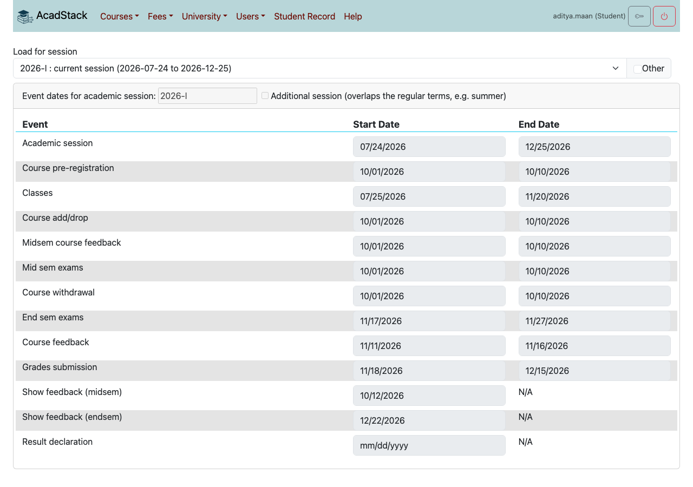
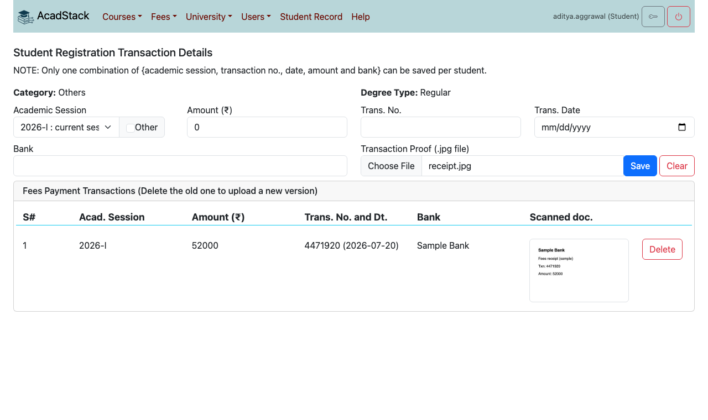
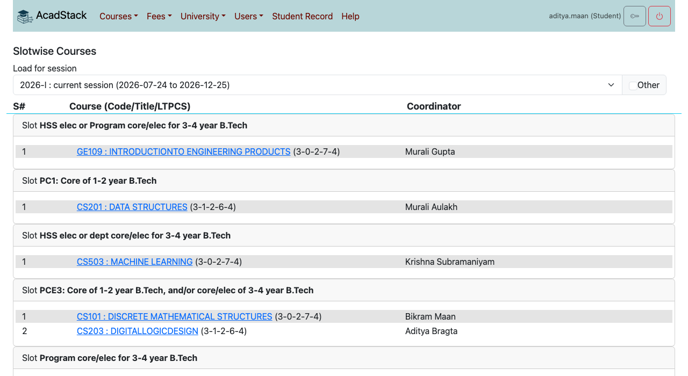
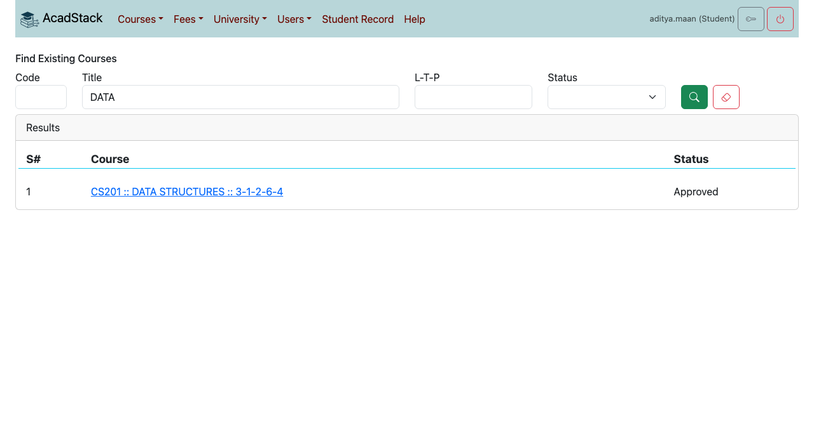
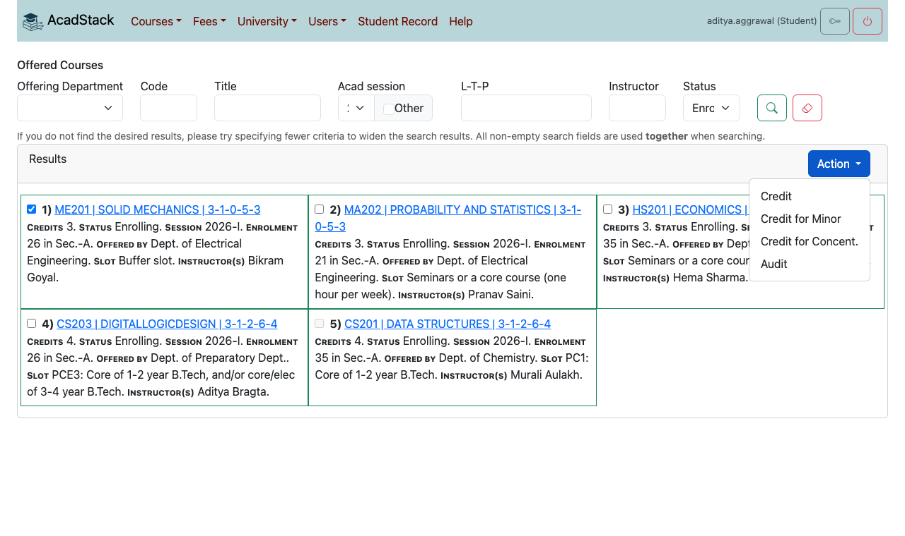
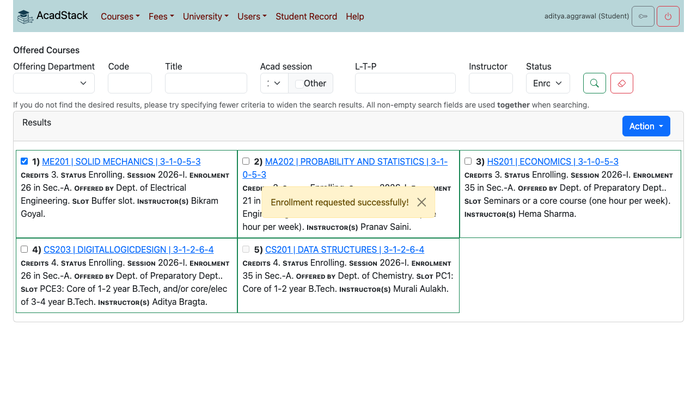
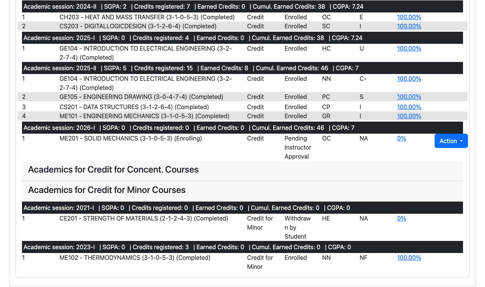
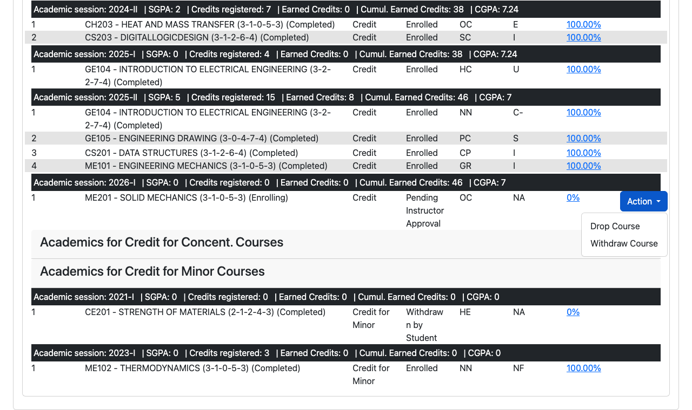
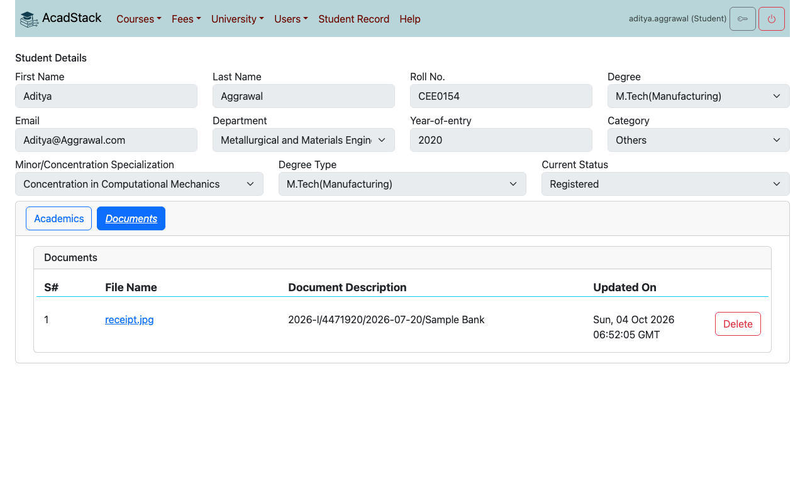
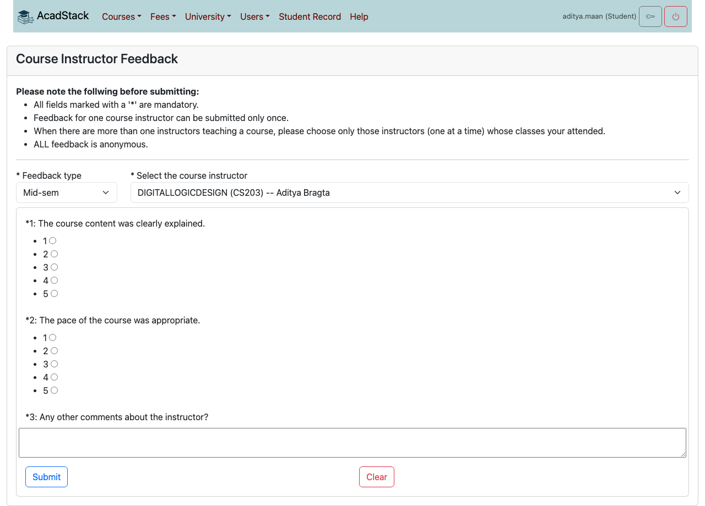

# 2. Students

This chapter is for students. It covers your academic record, finding and enrolling in courses, dropping or withdrawing, attendance, course feedback, fees and, for doctoral students, the doctoral committee.

Read [chapter 1](01-getting-started.md) first if you have not signed in before.

## Contents

1. [What you can do](#what-you-can-do)
2. [Dates that decide what you can do](#dates-that-decide-what-you-can-do)
3. [Submitting your fee payment details](#submitting-your-fee-payment-details)
4. [Finding courses](#finding-courses)
5. [Enrolling in courses](#enrolling-in-courses)
6. [Following your enrolment](#following-your-enrolment)
7. [Dropping or withdrawing from a course](#dropping-or-withdrawing-from-a-course)
8. [Your Student Record](#your-student-record)
9. [Attendance](#attendance)
10. [Course feedback](#course-feedback)
11. [Doctoral committee (PhD students)](#doctoral-committee-phd-students)

## What you can do

| Menu item | Use it to |
|---|---|
| *Student Record* | See your details, every course you have taken, grades, attendance, and your uploaded documents. Drop or withdraw from courses. |
| *Courses → Courses Offered For Enrolment* | Find the courses offered in a session and request enrolment. |
| *Courses → Slotwise Courses* | See the courses of a session grouped by timetable slot. |
| *Courses → Courses Available For Offering* | Browse the course catalogue. |
| *Courses → Course Feedback* | Give feedback about your instructors. |
| *Fees → Fees Payment Record* | Submit and see your fee payment details. |
| *University → Academic Events* | See the dates of the academic session. |
| *Users → Profile Photo* | Upload your photo (see [chapter 1](01-getting-started.md#your-profile-photo)). |
| *PhD → Search Doctoral Committee* | PhD students only: see your doctoral committee. |

## Dates that decide what you can do

Most actions work only inside a date window set by the academic office for each session. Open *University → Academic Events* and choose the session to see the dates.

| Event on the screen | What it opens |
|---|---|
| Course pre-registration, Course add/drop | Enrolling in courses for credit, and dropping a course. |
| Course withdrawal | Withdrawing from a course, and enrolling as an **Audit**. |
| Midsem course feedback, Course feedback | Submitting the mid-semester and the end-semester feedback. |

Outside a window, AcadStack refuses the action with a message such as "Course enrolment/add not open for 2026-I". Wait for the window, or contact the academic office.

## Submitting your fee payment details

Your university may ask you to record your semester fee payment before you enrol. If it does, a request to enrol without it fails with the message:

> Semester registration fees payment details/proof are required before submitting enrolment requests! Kindly submit the necessary details first.

1. Open *Fees → Fees Payment Record*.
2. Choose the **Academic Session**, enter the **Amount**, **Trans. No.**, **Trans. Date** and **Bank**.
3. Under **Transaction Proof (.jpg file)** press **Choose File** and pick a scan or photo of the receipt (a .jpg file).
4. Press **Save** and confirm.

The record appears in the table below the form, with a thumbnail of the proof. The same proof also appears on the **Documents** tab of your Student Record.

**What to know**

- You cannot edit a saved record. To correct it, press **Delete** on that row and save it again.
- Only one record with the same session, transaction number, date, amount and bank can be saved.

## Finding courses

Open *Courses → Courses Offered For Enrolment*. Fill in any of the search fields, then press the magnifier button. The eraser button clears the form.

| Field | Meaning |
|---|---|
| Offering Department | The department that offers the course. |
| Code, Title | Part of the course code or title. |
| Acad session | The session. Tick **Other** to type a session that is not in the list. |
| L-T-P | Lecture-tutorial-practical pattern, for example `3-1-0`. |
| Instructor | Part of an instructor's name. |
| Status | **Enrolling** and **Running** offerings accept enrolment. |

All the fields you fill are used together, so use fewer to see more. Each result shows the credits, status, session, enrolment so far, the department, the slot and the instructors. Open a course title for its details.

*Courses → Slotwise Courses* lists a session's courses grouped by slot, which helps you avoid timetable clashes.

*Courses → Courses Available For Offering* is the catalogue of courses. A course can be offered in a session only if it is in the catalogue.

## Enrolling in courses

Your enrolment is a **request**. It must be approved before you are enrolled (see [Following your enrolment](#following-your-enrolment)).

1. Open *Courses → Courses Offered For Enrolment*, and search for the **Enrolling** or **Running** offerings of the session.
2. Tick the box in front of each course you want. A course you have already passed has a box you cannot tick.
3. Press **Action** at the top of the results and choose the kind of enrolment:
   - **Credit**, the normal choice;
   - **Credit for Minor** or **Credit for Concent.**, for a course you take for a minor or a concentration (ask your advisor which one applies);
   - **Audit**, to attend without credit.

   

4. AcadStack shows "Enrollment requested successfully!".

**What to know**

- Credit enrolments need the **Course pre-registration** or **Course add/drop** window to be open. **Audit** needs the **Course withdrawal** window.
- You can request several courses at once. If one of them fails a check, nothing from that request is saved. Read the message, fix the cause, and try again.
- The total credits you can take in a session are limited (24 unless your university has changed it). Over the limit AcadStack says "Max. 24 credits allowed! Please remove course enrolments."
- Two courses whose slots overlap in the week cannot both be taken. The message lists the clashing slots, days and times.

Messages you may meet when you request:

| Message | What it means |
|---|---|
| Semester registration fees payment details/proof are required... | Save your fee payment details first. |
| Course enrolment/add not open for 2026-I | The add/drop window is closed. |
| Course enrolment/Audit not open for 2026-I | The withdrawal window is closed, and audit enrolment uses it. |
| Slot timing not setup for slot: '...'. Please contact the administrator. | The academic office has not entered the timings of that slot. Tell them. |
| Course ... is not offered for (your degree, year and department). Kindly check the Crediting Categorization of the ... | The course is not in the course list for your programme and entry year. Ask your advisor or the academic office. |
| Enrollment already exists for one of the selected courses. | You already asked for it. |
| Please select a course to enrol! | You pressed an action without ticking a course. |

## Following your enrolment

An enrolment passes through these steps:

1. **Pending Instructor Approval**: your request is waiting for the course instructor.
2. **Pending Advisor Approval**: the instructor approved, and your batch advisor is next.
3. **Enrolled**: the advisor approved. You are in the course.

At either step it can instead end as **Instructor Rejected**, **Advisor Rejected** or **Academic section Rejected**. You can also end it yourself: **Dropped by Student** or **Withdrawn by Student**. When your request is saved, AcadStack emails both you and the course instructor.

Open *Student Record* to see the status. It opens with **Show only Enrolled** ticked. Untick it to see requests that are still pending or have ended.

The home page reminds you to contact the course instructor directly for any change to your enrolment requests.

## Dropping or withdrawing from a course

1. Open *Student Record*, and untick **Show only Enrolled** if the course is not listed.
2. On the course's row press **Action**, then choose **Drop Course** or **Withdraw Course**.
3. Confirm the question "Confirm course drop?" (or withdraw).

**What to know**

- **Drop Course** is allowed in the add/drop window. **Withdraw Course** is allowed in the withdrawal window. An option that is not open now is greyed out.
- An audited course can be dropped or withdrawn only in the withdrawal window.
- The Action menu shows only for courses that are **Enrolling** or **Running** and are not already dropped or withdrawn.
- You can change only your own enrolments.

## Your Student Record

*Student Record* has your details at the top (name, roll number, degree, department, year of entry, category, status) and two tabs.

**Academics** lists your courses grouped by kind of enrolment (Credit, Credit for Concent., Credit for Minor), then by session. A dark bar above each session shows the session's **SGPA**, **Credits registered**, **Earned Credits**, **Cumul. Earned Credits** and **CGPA**. For each course you see:

| Column | Meaning |
|---|---|
| Course | Code, title and L-T-P-S-C pattern, with the offering's status. |
| Enrol. | Credit, Audit and so on. |
| Enrol. status | Where the enrolment stands (see [Following your enrolment](#following-your-enrolment)). |
| Course cat. | The category of the course for your programme. |
| Grade | Your grade. Some grades may still be waiting for approval by the senate. The records confirmed by the academic section take precedence over what is shown here. |
| Attd. | Your attendance percentage. Open it for the dates. |

**Documents** lists the files kept for you, such as the fee payment proofs you uploaded, with their description and update time.

Your details at the top are read-only. If something is wrong, ask the academic office to correct it.

## Attendance

Press the percentage in the **Attd.** column of the Student Record to see the attendance for that course by date: **P** for present, with a classroom photo if the instructor marked attendance from a photo. You cannot change attendance. If a mark is wrong, speak to the instructor.

## Course feedback

Feedback is anonymous. Your instructors never see who wrote it.

1. Open *Courses → Course Feedback*.
2. Choose the **Feedback type**: **Mid-sem** or **End-sem**. AcadStack loads the form that is currently active. If the academic office has not made a form of that type active, you see "Requested feedback form not found!".
3. Choose the **course instructor**. The list holds only the instructors of your enrolled courses whose feedback you have not yet given.
4. Answer every question marked with `*`. Questions that allow several answers show checkboxes.
5. Press **Submit** and confirm.

AcadStack shows "Feedback successfully submitted!". The form can be filled in at any time, but it is accepted only while the matching window is open (**Midsem course feedback** for Mid-sem, **Course feedback** for End-sem). Outside the window you get "Feedback MID_SEM_FB not open for 2026-I." (or END_SEM_FB). Once you submit, that instructor then disappears from the list for that feedback type, because feedback for one instructor can be given only once. If the list is empty, you have nothing pending ("You do not seem to have any pending feedback!").

Choose the instructors whose classes you attended, one at a time, when a course has more than one.

## Doctoral committee (PhD students)

If your programme is PhD, the menu bar has a **PhD** menu. Open *PhD → Search Doctoral Committee* to see your doctoral committee (DC) with its members and status: Draft, Submitted to HoD, Forwarded to Dean, Returned to Supervisor, Approved, Returned to HoD or Deleted. Your supervisor forms the committee and it is approved by the head of department and the dean. You can only look at your own committee. Progress reports are written by your committee members, not by you.
