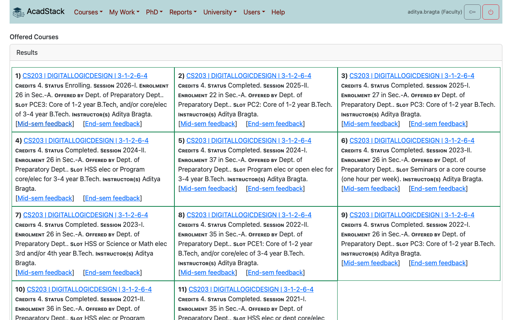
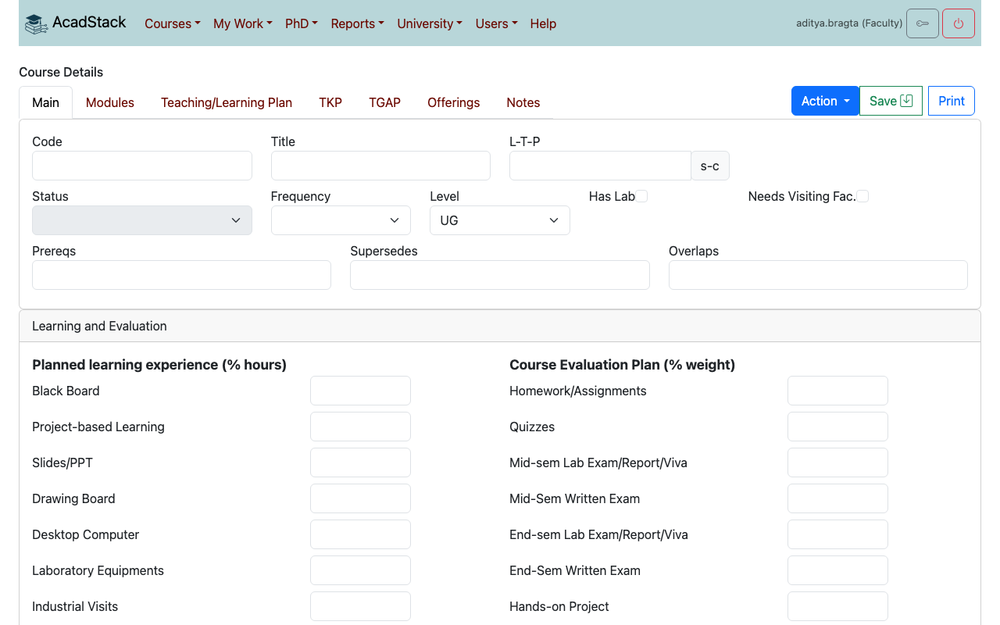
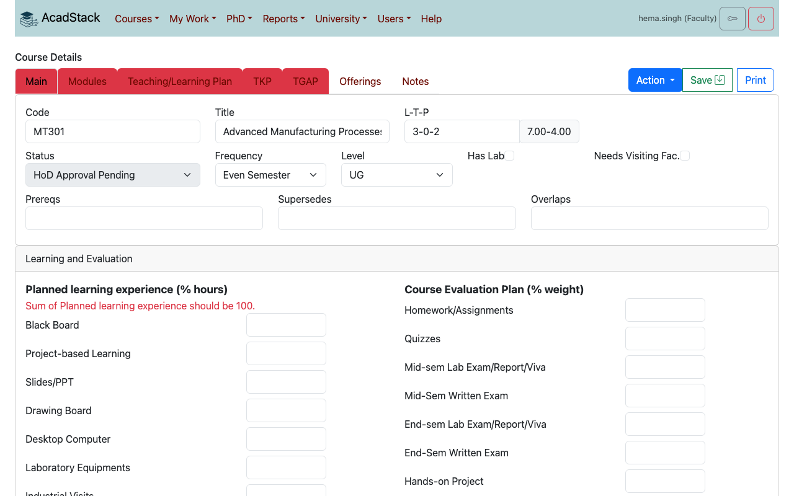
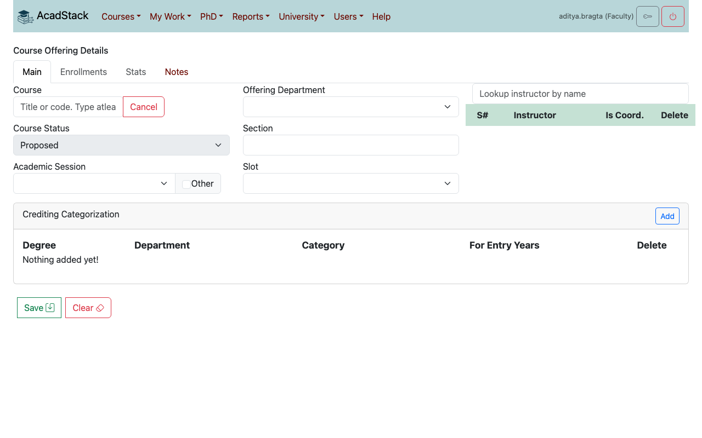
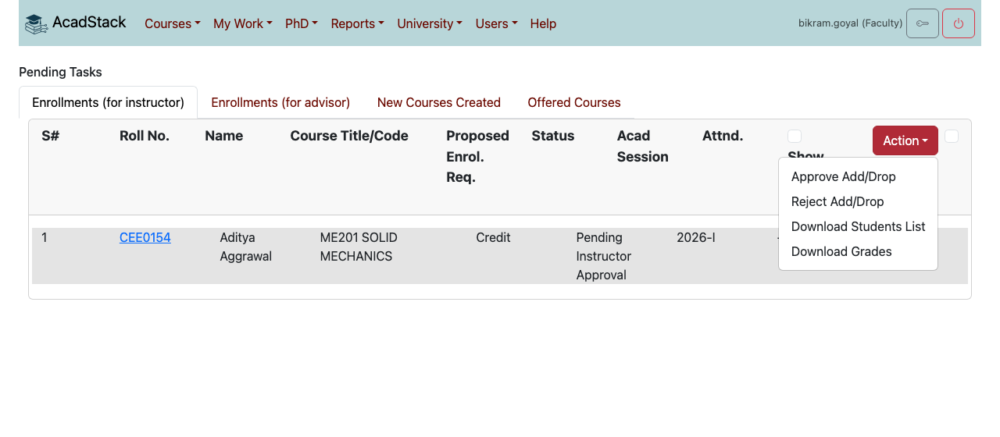
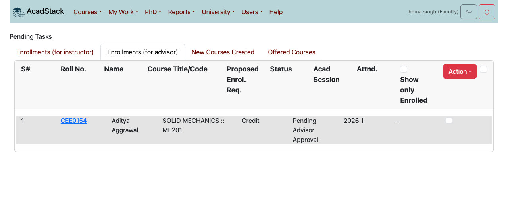
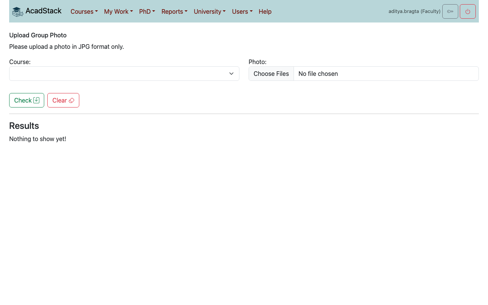
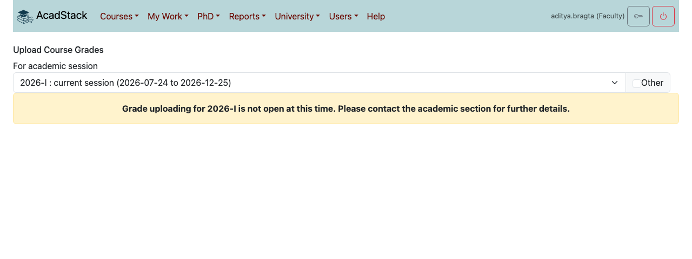
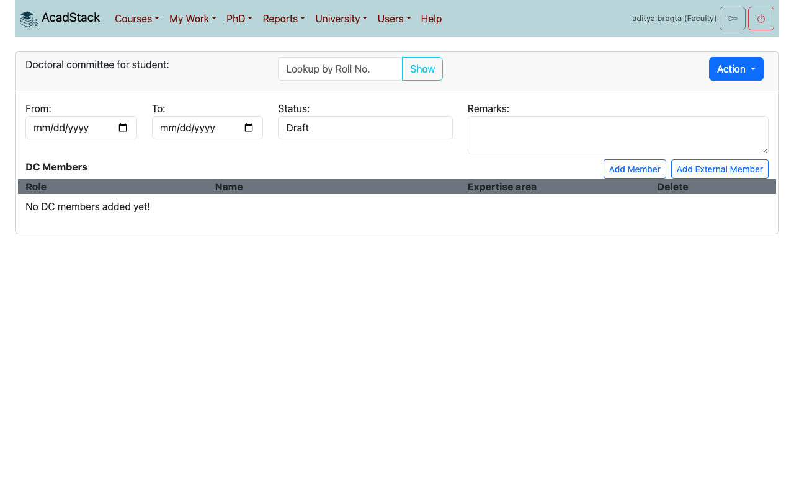
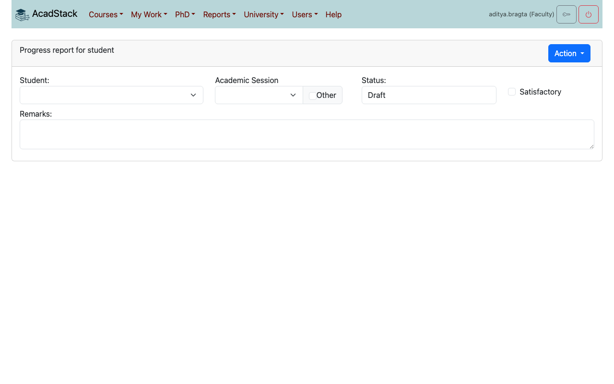

# 3. Faculty and advisors

This chapter is for faculty members. It covers creating and offering courses, approving students' enrolments (as an instructor, and as a batch advisor), attendance, grades, feedback and, for faculty who supervise doctoral students, doctoral committees and progress reports.

Read [chapter 1](01-getting-started.md) first if you have not signed in before.

## Contents

1. [What you can do](#what-you-can-do)
2. [My Work](#my-work)
3. [Creating a course](#creating-a-course)
4. [Offering a course](#offering-a-course)
5. [Approving enrolments](#approving-enrolments)
6. [Attendance](#attendance)
7. [Uploading grades](#uploading-grades)
8. [Feedback about your teaching](#feedback-about-your-teaching)
9. [Doctoral committees and progress reports](#doctoral-committees-and-progress-reports)
10. [Looking people up and reports](#looking-people-up-and-reports)

## What you can do

| Menu item | Use it to |
|---|---|
| *My Work → Courses Offered*, *Courses Created*, *Action Pending* | Your own offerings, your own courses, and the things waiting for your approval. |
| *Courses → Create New Course* | Write a new course and send it for approval. |
| *Courses → Offer a Course For Enrolment* | Offer a course in a session. |
| *Courses → Courses Offered For Enrolment*, *Slotwise Courses*, *Courses Available For Offering* | Look at what is offered and the course catalogue. |
| *Courses → Mark Attendance*, *View Attendance* | Take attendance from a class photo, and see it. |
| *Courses → Upload Grades* | Submit the grades of a course you coordinate. |
| *PhD → ...* | Doctoral committees and progress reports. |
| *Users → Find User*, *Find Students* | Look people up. |
| *Reports → Check Total Credits*, *Check Category-wise Credits*, *Generate Course Enrolments* | Reports on credits and enrolments. |
| *University → Academic Events* | The dates of the session. |

A head of department sees the same screens with extra approval steps. Staff roles in the academic office have more, see [chapter 4](04-academic-office-hod-dean.md).

## My Work

- *My Work → Courses Offered*: the offerings that name you as an instructor. Each shows its credits, status, session, enrolment, slot and instructors. Open the title to see or change the offering. The links **Mid-sem feedback** and **End-sem feedback** open the feedback your students gave you (see [Feedback about your teaching](#feedback-about-your-teaching)).
- *My Work → Courses Created*: the courses you wrote, with their approval status.
- *My Work → Action Pending*: your approval inbox. See [Approving enrolments](#approving-enrolments). If you are a batch advisor it also holds your advisor tasks.

## Creating a course

A course is the catalogue entry: code, title, hours, content and how it is taught and assessed. It exists once. You then **offer** it in each session.

1. Open *Courses → Create New Course*.
2. On the **Main** tab enter the **Code**, **Title** and **L-T-P** (lecture, tutorial and practical hours per week, for example `3-1-2`). AcadStack works out the "s-c" value (self-study hours and credits) next to it. Fill in the **Frequency**, **Level**, **Has Lab**, **Needs Visiting Fac.**, **Prereqs**, **Supersedes** and **Overlaps** where they apply.
3. Fill in *Learning and Evaluation*: **Planned learning experience (% hours)** and **Course Evaluation Plan (% weight)**.
4. Fill in the other tabs: **Modules**, **Teaching/Learning Plan**, **TKP** and **TGAP**.
5. Press **Save**, and confirm. The course is saved as a **Draft**. You can come back to it from *My Work → Courses Created*.

A Draft may be incomplete. To send the course for approval it must be complete:

| Tab | Rule |
|---|---|
| Main | Code and title entered. The planned learning experience adds up to **100**. The evaluation weights add up to **100**. |
| Modules | At least one module, with all three of its fields filled in. |
| Teaching/Learning Plan | At least one reference material and at least one teaching item, each with both fields filled in. |
| TKP | At least two items ticked. |
| TGAP | At least two items ticked. |

When you are ready press **Action → Submit**. If something is missing the tabs that need work turn red and a message under the field says what to fix, for example "Sum of Planned learning experience should be 100." Nothing is changed while there are errors, even if the Status box on the screen briefly shows the new status. Reopen the course from *My Work → Courses Created* to see its real status.

### How a course is approved

| Step | Who | Actions | Resulting status |
|---|---|---|---|
| 1 | You (the author) | **Submit** or **Delete** | HoD Approval Pending |
| 2 | Head of department | **Forward** or **Return to Faculty** | Council Approval Pending, or HoD Rejected |
| 3 | Dean | **Approve** or **Return to Dept.** | Approved, or Council Rejected |

A course that is HoD Rejected or Council Rejected comes back to you to correct and submit again. Only an **Approved** course can be offered. The **Notes** tab holds comments that go with the course through these steps. **Print** gives a printable version of the course.

## Offering a course

1. Open *Courses → Offer a Course For Enrolment*.
2. Press **Lookup** beside **Course** and type at least three characters of the title or code, then choose the course.
3. Choose the **Offering Department**, the **Acad session**, the **Section** and the **Slot**.
4. Under **Instructor** look up the instructors by name. Tick **Is Coord.** for the coordinator. Only the coordinator can upload grades and attendance. There must be at least one instructor.
5. Under **Crediting Categorization** press **Add** for each programme the course counts for, and fill in the **Degree**, **Department**, **Category** and **For Entry Years** (for example `2019,2020`). Every field of a row is required. A student can enrol only if their degree, department and entry year match a row. Otherwise they see "Course ... is not offered for ...".
6. Press **Save** and confirm.

Use **Action** to move the offering along. What you see depends on your role:

| Who | Actions | Status after |
|---|---|---|
| You (the instructor) | **Propose**, **Cancel** | Proposed, Canceled |
| Head of department | **Enrolling**, **Return to Faculty** | Enrolling, Declined |
| Academic office | **Enrolling**, **Running**, **Return to Dept.**, **Cancel** | Enrolling, Running, Declined, Canceled |

Students can request enrolment while the offering is **Enrolling** or **Running**. Once students are enrolled, the **Enrollments** tab lists them, and **Stats** shows the grade distribution and attendance trend when there is data.

### Evaluation components

On the **Main** tab of an offering, the **Evaluation Components** box lists the parts of the assessment (for example Quiz 1, Mid-sem). Give each a **Code (CSV column)**, a **Name** and a **Weight %**, then press the save button. The codes become columns for scores in the grades file (see [Uploading grades](#uploading-grades)).

## Approving enrolments

A student's enrolment request goes through you and then the batch advisor:

1. The student requests. The request waits for the **course instructor**.
2. The instructor approves, and it moves to **Pending Advisor Approval**.
3. The **batch advisor** of the student's batch approves, and the student is **Enrolled**.

Either of you can reject instead.

**As an instructor**

1. Open *My Work → Action Pending*. The **Enrollments (for instructor)** tab lists requests for your courses, with the student's roll number, name, course, requested enrolment type, status, session and attendance.
2. Tick the requests you want to act on. The box in the table header ticks them all.
3. Press **Action**, then **Approve Add/Drop** or **Reject Add/Drop**, and confirm.

AcadStack shows "Updated enrollments!".

**As a batch advisor**

A **batch** is the students of one programme and department who joined in one year. The academic office assigns you as the advisor of a batch (see [chapter 4](04-academic-office-hod-dean.md#batch-advisors)). The advisor must belong to the same department as the batch.

1. Open *My Work → Action Pending* (or *My Work → Pending Tasks* if you have that item) and press the **Enrollments (for advisor)** tab. It lists the requests that the instructors have approved for students of your batch.
2. Tick the requests, then use **Action → Approve Add/Drop** or **Reject Add/Drop**.

**What to know**

- The other tabs on this page hold your course tasks: **New Courses Created** (courses you wrote that are not yet approved) and **Offered Courses** (offerings still **Proposed**). A head of department sees courses to forward, and a dean sees courses to approve.
- A student can drop or withdraw on their own, see [chapter 2](02-students.md#dropping-or-withdrawing-from-a-course).
- The student can also be changed by the academic office, which can enrol, reject or change a status directly.

## Attendance

Attendance is taken from a class photo. AcadStack finds the faces of your enrolled students in the photo.

**Before you start:** each student must have uploaded a profile photo (*Users → Profile Photo*, see [chapter 1](01-getting-started.md#your-profile-photo)). A student with no photo cannot be recognised and is left out. If none of your students has a photo, AcadStack says "None of the enrolled students have their photos in the database!".

1. Open *Courses → Mark Attendance*.
2. Choose the **Course**. The list shows your offerings that are running.
3. Press **Choose File** and pick one or more class photos (.jpg). Use several photos if one cannot show everyone.
4. Press **Check** and confirm.

AcadStack answers "Saved 1 photos for processing." The photos are processed in the background, so the result is not on the screen at once. Students recognised in the photos are marked **P** (present) for today. The other enrolled students who have a profile photo are marked **A** (absent). A student already marked present today stays present if another photo does not show them.

Only the coordinator of the course can take attendance. Otherwise AcadStack says "Insufficient privileges. Only the course coordinator can upload attendance."

### Viewing attendance

Open *Courses → View Attendance*, choose a **Course** and how to **Show results**:

- **Day-wise**: for each date, how many were present and absent. Open a date to see who and the photos.
- **Student-wise**: a list of the course's students with roll number, name, enrolment type, status and attendance percentage.

A student sees the same record for themselves from their Student Record.

## Uploading grades

Only the coordinator of an offering can upload its grades, and only while grade submission is open for the session (the **Grades submission** dates in *University → Academic Events*). At other times the page says "Grade uploading for 2026-I is not open at this time. Please contact the academic section for further details."

1. Open *Courses → Upload Grades* and choose the **academic session**.
2. In the box, type at least three characters of the course name or code and pick the offering.
3. Press **Download Enrolled Students List**. You get a .csv file with a row for each enrolled student.
4. Fill in the **GRADE** column for every student, using the grades of your university's grading scheme. Keep the other columns as they are.
5. If you also want to upload scores, tick the evaluation components that you are including (see [Evaluation components](#evaluation-components)), download the list again so it has a column for each, and enter scores from 0 to 100 (or leave blank).
6. Under **Submit Grades** choose the file and press the button.

**Rules the file must meet**

- Use the downloaded file's header row. It starts with `FIRST_NAME,LAST_NAME,ROLL_NO,GRADE`. Otherwise AcadStack says "Invalid header row in CSV".
- Every enrolled student must be in the file, and no one who is not enrolled. Otherwise the message lists the missing or extra roll numbers.
- Each grade must be allowed for that student's programme and the enrolment type. An audited course accepts fewer grades than a credit course. A bad grade is reported with the row and the list of allowed grades.
- Scores must be numbers from 0 to 100 or blank, and a selected component must have a column.

If any check fails, nothing is saved. Fix the file and upload it again.

## Feedback about your teaching

Students give feedback anonymously, in the middle and at the end of the session. You can read your own results.

1. Open *My Work → Courses Offered*.
2. On an offering press **Mid-sem feedback** or **End-sem feedback**.

The results are shown only after the dates **Show feedback (midsem)** and **Show feedback (endsem)** in *University → Academic Events*. The academic office and the dean can see the feedback of every instructor.

## Doctoral committees and progress reports

Use this section if you supervise doctoral (PhD) students or serve on a doctoral committee (DC).

### Forming a doctoral committee

*PhD → Doctoral Committee Formulation*.

1. Choose the **student**. The supervisor must be an instructor, and student and supervisor must be from the same department.
2. Enter the **From** and **To** dates of the committee. They must not overlap another committee of the same student.
3. Press **Add Member** to add a member from the university, or **Add External Member** and enter the name and contact. Give each member a **Role**: Member, Supervisor, Co-Supervisor or Chairperson. A committee needs at least one Member, a Supervisor and a Chairperson, otherwise AcadStack says "At least one DC member, supervisor and the DC chairperson is required!"
4. Use **Action** to save and move it along.

| Who | Actions | Status after |
|---|---|---|
| Supervisor | **Save as Draft**, **Submit to HoD**, **Delete** | Draft, Submitted to HoD, Deleted |
| Head of department | **Forward to Dean**, **Return to Supervisor** | Forwarded to Dean, Returned to Supervisor |
| Dean (and academic office) | **Approve**, **Return to HoD**, **Return to Supervisor**, **Save as Draft**, **Delete** | Approved, Returned to HoD, Returned to Supervisor, Draft, Deleted |

*PhD → Search Doctoral Committee* finds committees by status, department, entry year, student or member.

### Progress reports

Each doctoral committee member writes a progress report on the student each session. The committee chair approves them.

1. Open *PhD → Submit Progress Report*.
2. Choose the **Student** (the list holds the students whose committee you are on) and the **Academic Session**.
3. Tick **Satisfactory** if the progress is satisfactory, and write your **Remarks**.
4. Use **Action**: **Save as Draft** to keep it, or **Submit to DC Chair** to send it.

The chair then uses **Approve as DC Chair**. Only the chair can approve. A member can write one report per student per session.

*PhD → My Progress Reports* shows all the reports on a student: the DC member, status (Draft, Returned to DC Member, Submitted to DC Chair, Approved), session, whether it is satisfactory, and the remarks. Choose a student at the top to see theirs.

## Looking people up and reports

- *Users → Find User* and *Users → Find Students* search for people and open their records.
- *Reports → Check Total Credits* and *Check Category-wise Credits* report the credits students have earned.
- *Reports → Generate Course Enrolments* downloads the enrolments of a department and entry year in a session.
