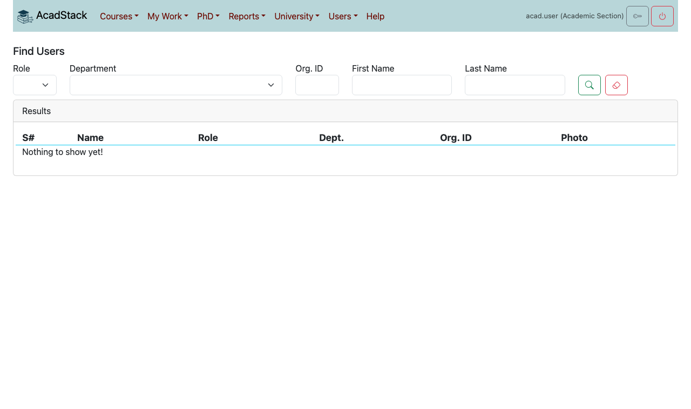
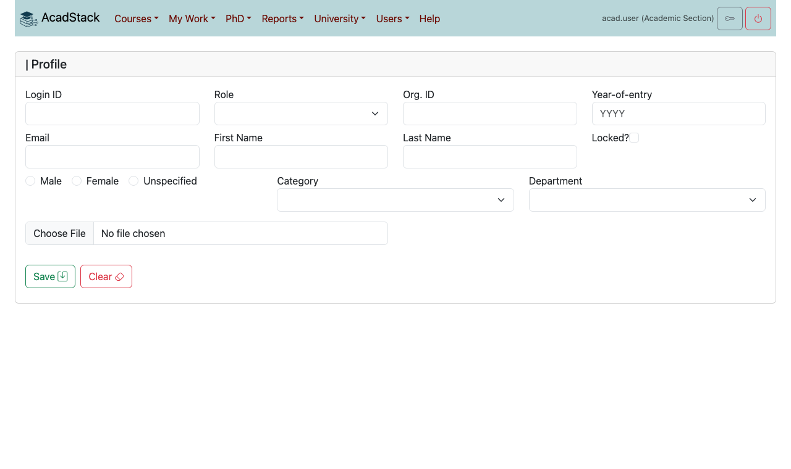
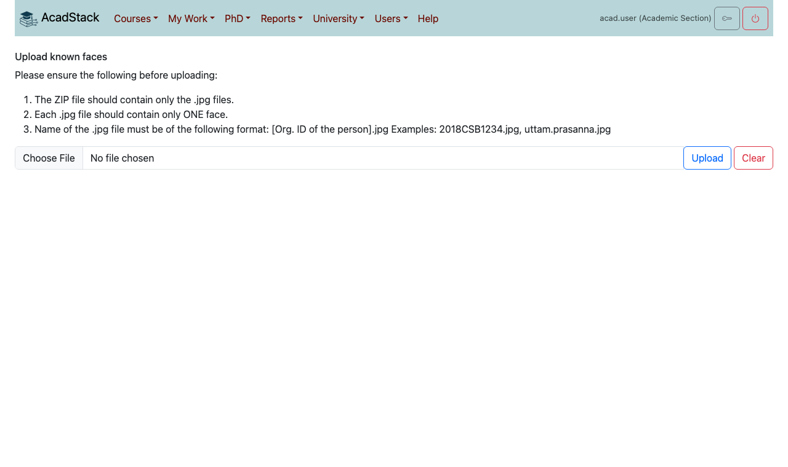
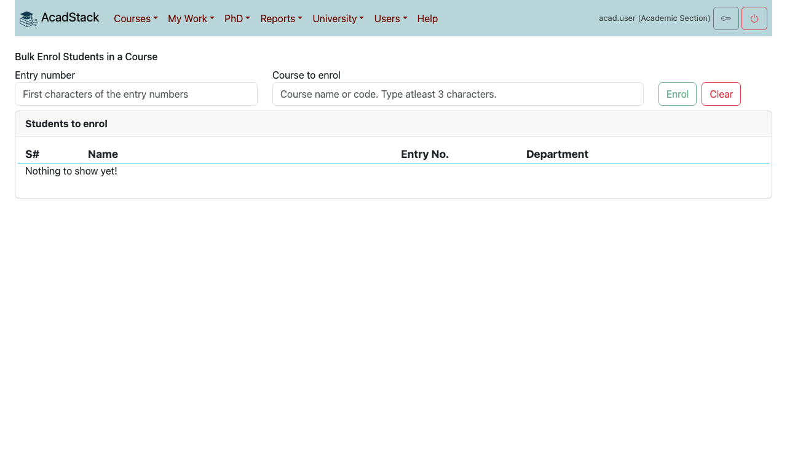
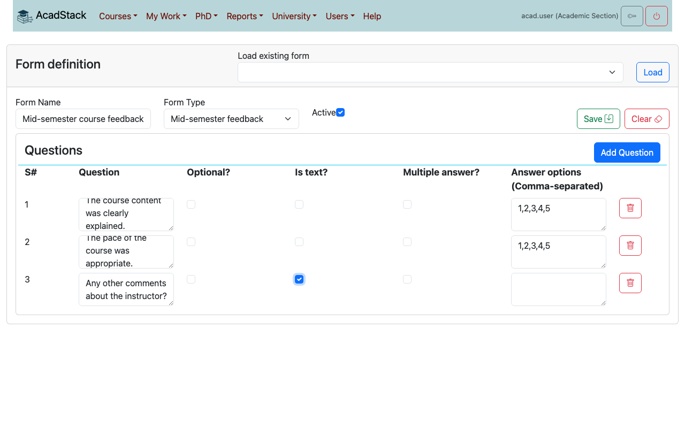
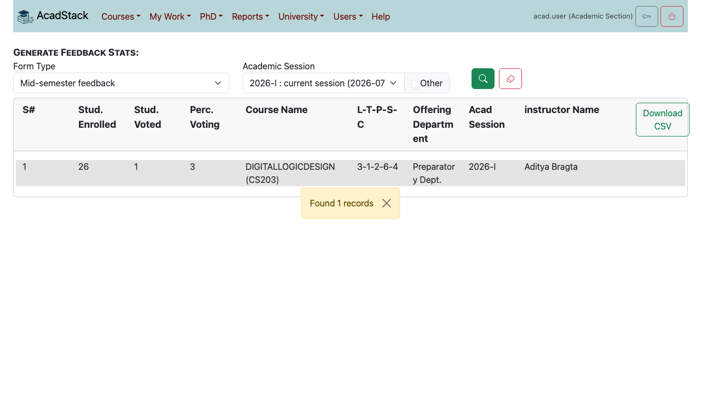
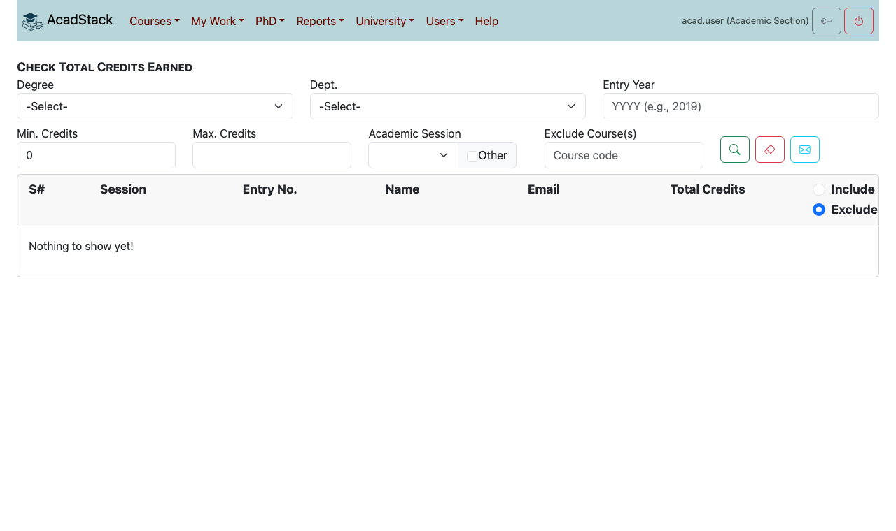
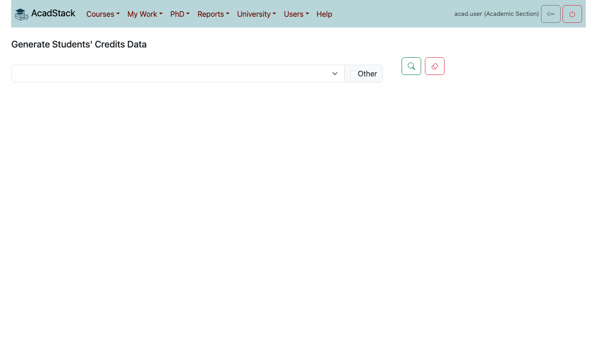

# 4. Academic office, HOD and Dean

This chapter is for the academic section (office) staff, heads of department (HoD) and the dean of academics. These roles have the most menu items. What you see still depends on the permissions of your role, so a head of department sees fewer items than the academic section. Faculty tasks, such as writing a course or approving an enrolment as an instructor, are in [chapter 3](03-faculty-and-advisors.md).

Setting AcadStack up for a university (lists, roles, settings, grading scheme) is in [Setting up AcadStack for your university](../university_setup.md). This chapter covers the work you do every semester.

## Contents

1. [What each role does](#what-each-role-does)
2. [Users](#users)
3. [Courses and offerings](#courses-and-offerings)
4. [Approvals](#approvals)
5. [Feedback forms and statistics](#feedback-forms-and-statistics)
6. [Reports](#reports)
7. [University menu: day-to-day items](#university-menu-day-to-day-items)
8. [Doctoral committees](#doctoral-committees)

## What each role does

| | Academic section | Head of department | Dean |
|---|---|---|---|
| Users: find, create, bulk add, upload photos, batch advisors | Yes | Find only | Find, batch advisors |
| Courses: offer, create, bulk create, bulk enrol, upload grades | Yes | Offer, create | Yes |
| Approve a course | Approve | Forward to the dean | Approve |
| Move an offering to Enrolling or Running | Yes | Enrolling | Yes |
| Feedback forms and statistics | Yes | | Yes |
| Reports | All | Credits and enrolments | All |
| Doctoral committees | Any | Of the department | Approve |

Open *My Work* to see what is waiting for you.

## Users

### Finding users and students

- *Users → Find User* searches by **Role**, **Department** and name. Open a result to see the record.
- *Users → Find Students* searches students by roll number, name and degree. Open a student's record to see their academics, documents and fees as the student sees them (see [chapter 2](02-students.md#your-student-record)).

### Creating or changing one user

*Users → New User* creates a user. To change a user, open them from *Find User*.

1. Enter the **Login ID**, **Role**, **Org. ID** (the roll number or employee number), **Email**, **First Name** and **Last Name**.
2. For students enter the **Year-of-entry**. Choose the **Category** and **Department**, and the gender.
3. Press **Save**.

**What to know**

- Tick **Locked?** to stop a user from signing in. Untick it to let them back in.
- To help someone who has lost their password, open their record and press **Generate Password Reset Key**. Give the key to them in person. It works for 30 minutes. They use it on the login page under **[Password Reset]** (see [chapter 1](01-getting-started.md#if-you-forget-your-password)). You never see or set their password.
- Do not change a person's Org. ID casually. Course enrolments, grades and reports are matched on it.

### Adding many users at once

*Users → Add Users* creates users from a CSV file. The columns, the checks and the way to read the preview are described in [Add Users](../university_setup.md#8-add-users).

### Photos for attendance

Faculty take attendance from class photos, and AcadStack recognises students from a photo of each student. A student can upload their own (see [chapter 1](01-getting-started.md#your-profile-photo)). To load many at once use *Users → Upload User Faces*.

1. Prepare a **ZIP** file of **.jpg** photos only.
2. Each photo shows **one face**.
3. Name each file with the person's Org. ID, for example `2018CSB1234.jpg`.
4. Choose the file and press **Upload**.

### Batch advisors

A batch advisor approves the course enrolments of one batch of students (one programme, department and entry year). *Users → Manage Batch Advisors* assigns the advisor: enter the **Entry Year**, **Dept.** and **Degree**, press **Find**, then look up a faculty member from the same department and press **Assign**. The steps are in [Manage Batch Advisors](../university_setup.md#10-manage-batch-advisors).

Assign an advisor for every batch before students start to enrol. A request that the instructor has approved waits at the advisor step, and a batch without an advisor has nobody to approve it except staff with wider rights.

## Courses and offerings

These screens are the same as faculty use (see [Creating a course](03-faculty-and-advisors.md#creating-a-course) and [Offering a course](03-faculty-and-advisors.md#offering-a-course)). The differences for your role:

- The academic section and the dean can offer a course for any department and can set an offering to **Enrolling**, **Running**, **Return to Dept.** or **Cancel**. A head of department can set **Enrolling** or **Return to Faculty** for the department's offerings.
- *Courses → Bulk Create Courses* adds courses from a CSV file. See [Bulk Create Courses](../university_setup.md#9-bulk-create-courses).
- *Courses → Slotwise Courses* lists a session's courses by slot. Use it to check the timetable.

### Bulk enrolling students in a course

Use *Courses → Bulk Enrol in Course* to enrol a whole class at once, for example a compulsory first-year course.

1. In **Entry number** type the first characters of the roll numbers, for example `2026CSB`.
2. In **Course to enrol** type at least three characters of the course name or code, and pick the offering.
3. Press **Enrol**. AcadStack asks, for example, "Enrol 25 students whose entry number starts with "2026CSB" in ME201 SOLID MECHANICS Sec. A (2026-I) : Electrical Engineering?" Check the number and the course, then confirm.

AcadStack enrols every **registered** student whose roll number starts with those characters, for **credit**, and marks them **Enrolled** at once. There is no instructor or advisor approval and none of the checks that a student's own request goes through (fee record, dates, slot clash, credit limit).

If any of those students is already enrolled in the offering (or has an earlier enrolment record in it), nothing is saved and AcadStack says "Error when bulk enrolling students." Use a narrower roll-number prefix, or enrol the others one by one, and run it once per class.

### Grades

Grades are uploaded by the coordinator of each offering, see [Uploading grades](03-faculty-and-advisors.md#uploading-grades). Use *Reports → Check the Submitted Grades* to see which offerings still have grades pending.

## Approvals

*My Work → Action Pending* and *My Work → Pending Tasks* are the same inbox. The tabs you see depend on your role.

| Tab | Who sees it | What is in it |
|---|---|---|
| Enrollments (for advisor) | Head of department, and faculty who are batch advisors | Enrolment requests that the instructors approved. A head of department sees the requests of the department. |
| New Courses Created | Head of department, dean, academic section | Courses submitted for approval. The head of department sees those waiting for HoD approval, and those the dean returned. The dean and the academic section see those the HoD forwarded. |
| Offered Courses | Head of department | Offerings proposed by faculty of the department. |

The dean and the academic section see only **New Courses Created**.

To approve or reject enrolments tick the requests and use **Action → Approve Add/Drop** or **Reject Add/Drop**. To act on a course open it from the list and use **Action**:

- Head of department: **Forward** (to the dean) or **Return to Faculty**.
- Dean or academic section: **Approve** or **Return to Dept.**

To act on an offering open it and set its status (see above). The academic section can also change an enrolment directly: open the enrolment from the offering's **Enrollments** tab to set its status, type or grade.

## Feedback forms and statistics

Students give feedback with a form that you define. There is one active form per type: **Mid-semester feedback** and **End-semester feedback**.

### Creating a form

Open *Courses → Create Feedback*.

1. Enter a **Form Name** (at least five characters) and choose the **Form Type**.
2. Tick **Active** to make students see it. Only one form of a type should be active.
3. Press **Add Question** for each question. For each, enter the **Question** text and choose:
   - **Optional?**: students may leave it unanswered;
   - **Is text?**: a free-text answer;
   - **Multiple answer?**: students may tick more than one choice;
   - **Answer options**: the choices, separated by commas, for example `1,2,3,4,5`.
4. Press **Save**.

To change a form later pick it under **Load existing form** and press **Load**. Students can submit only while the dates **Midsem course feedback** and **Course feedback** of the session are open (see [Academic Events](../university_setup.md#5-academic-events)).

### Statistics

All four reports are under *Courses*. Choose the **Form Type** and the **Academic Session**, then press the magnifier. Each can be downloaded as a CSV.

| Report | Shows |
|---|---|
| *Feedback Stats* | For each instructor and course, how many students were enrolled and how many gave feedback, and the percentage. |
| *Dept Wise Feedback Average* | The average score of each question for each department. |
| *Course Wise Faculty Feedback Score* | The score of each instructor in each course, with the number of votes. |
| *Question Wise Faculty Feedback Score* | The same, split by question. |

Only offerings that are **Running** or **Completed** are counted. A course that is still **Enrolling** does not appear, even if students have given feedback.

Faculty see only their own results, from *My Work → Courses Offered*.

## Reports

All reports are under *Reports*. You see the ones your role may use. Most have a form of filters at the top and a table below; **Download CSV** saves the table.

| Report | What you give it | What you get |
|---|---|---|
| *Check Total Credits* | Degree, department, entry year, minimum and maximum credits, session, courses to exclude | Students whose earned credits fall in the range. |
| *Check Category-wise Credits* | Degree, department, entry year, course category, minimum and maximum credits | Students and their credits in that category. |
| *Generate Semester Grade* | A roll number, a session and an enrolment type | One student's grade sheet for the semester. |
| *Course Wise Grade Distribution* | A degree and a session | How many students got each grade in each course. |
| *Generation of CGPA and SGPA report* | A session | Each student's CGPA, SGPA and credits. |
| *Check the Submitted Grades* | Whether to list **Grades Submitted Till Date** or **Pending Grades**, and a session | The offerings and instructors concerned. |
| *Bulk Download Grade Sheet* | Degree, department, entry year, enrolment type | The semester grade sheets of a whole batch. |
| *Generate Consolidated Grade Sheet* | A roll number and an enrolment type | One student's consolidated grade sheet over all semesters. |
| *Generate Degree Certificate* | A roll number, name in a second language, thesis title (PhD only), document serial number, convocation date | A degree certificate. |
| *Generate Course Enrolments* | Department, entry year, session | Every enrolment of the batch, as a CSV. |
| *Student Strength Degree/Course wise* | A course code and a session | How many students each course has, by programme. |
| *Fees Payment Report* | Degree, department, entry year | The fee payment records that students of the batch have submitted. |

**Notifying students about credits.** On the two credit reports, if your role has the right, an envelope button emails the students you have marked, to tell them about a shortfall in credits.

**Grades are provisional until confirmed.** Reports show the grades in the system. Records confirmed by the academic section take precedence over anything shown.

## University menu: day-to-day items

The **University** menu holds the dates and timetable that many other screens depend on. Everyone can see *Academic Events*. Changing things needs the right permission.

- *University → Academic Events*: the dates of each session. They decide when students can enrol, drop, withdraw and give feedback, and when faculty can upload grades. Setting them is described in [Academic Events](../university_setup.md#5-academic-events). When something is "not open", this is the first place to check.
- *University → Course Slot Timings*: the weekly times of each slot. A course in a slot without timings cannot be enrolled in. See [Course Slot Timings](../university_setup.md#7-course-slot-timings).
- *University → Generate Students Credits Data*: calculates and stores the credits of every student enrolled in a session. Choose the **session** and press the magnifier. The work runs in the background, so press **Check Status** to see how it is going.

The other items in this menu (*Lists*, *Settings*, *Roles & Permissions*, *Grading Scheme*) are for the administrator and are described in [Setting up AcadStack for your university](../university_setup.md).

## Doctoral committees

Doctoral committees (DC) are formed by the supervisor, forwarded by the head of department and approved by the dean (see [Doctoral committees and progress reports](03-faculty-and-advisors.md#doctoral-committees-and-progress-reports)). The academic section can make any change.

*PhD → Search Doctoral Committee* finds committees by status, department, entry year, student or member. Use it to see which committees wait for the head of department or the dean.
